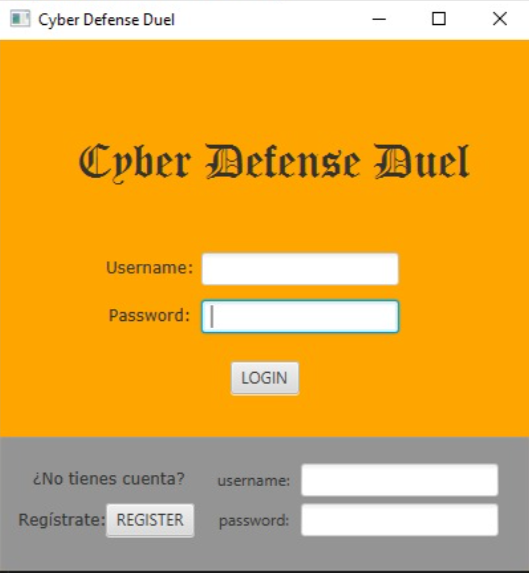
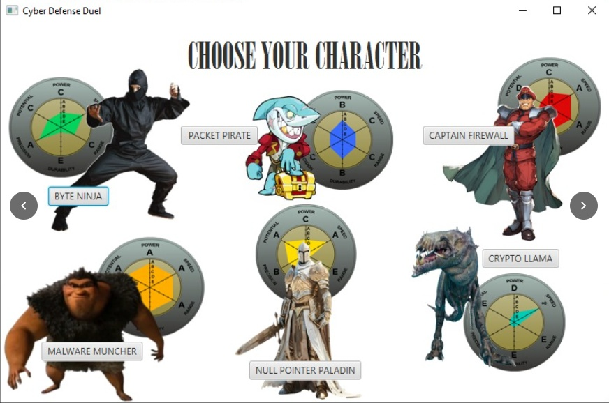
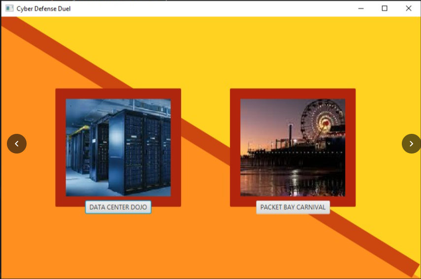

# 🛡️ Cyber Defense Duel


**Cyber Defense Duel** es un videojuego educativo multijugador 1 vs 1 desarrollado bajo el paradigma de programación orientada a objetos en Java. El sistema utiliza una arquitectura Cliente-Servidor comunicada mediante Sockets TCP y destaca por la implementación de **estructuras de datos construidas desde cero** (sin utilizar colecciones nativas de Java).

---

## 📸 Interfaz del Juego

### 1. Autenticación y Registro
Sistema seguro de inicio de sesión y registro de usuarios con persistencia en tiempo real.
<p align="center">
  
</p>

### 2. Selección de Avatar
Elige entre 6 defensores cibernéticos únicos, cada uno con estadísticas visualizadas mediante gráficos de radar.
<p align="center">
  
</p>

### 3. Entornos Temáticos
Selección dinámica de mapas para la partida, como el *Data Center Dojo* o el *Packet Bay Carnival*.
<p align="center">
  
</p>

### 4. Gameplay (Carriles de Defensa)
Sistema de combate en tiempo real donde debes moverte entre carriles para mitigar distintos tipos de ataques informáticos.
<p align="center">
  
</p>

---

## ✨ Características Principales

* **Arquitectura Cliente-Servidor:** Conexión estable mediante Sockets TCP. El servidor gestiona la lógica concurrente asignando un hilo (`Thread`) por cada cliente conectado.
* **Matchmaking Automatizado:** Sistema de cola (*Queue*) que empareja jugadores de forma automática para partidas 1 vs 1.
* **Estructuras de Datos Propias:** Implementación de Listas Enlazadas, Colas y Pilas genéricas basadas en Nodos (`Nodo<T>`), asegurando control total sobre el manejo de memoria sin depender de `java.util`.
* **Persistencia JSON:** Almacenamiento local de usuarios, avatares y estadísticas acumuladas de XP mediante la librería **Gson**.

## 🏗️ Arquitectura del Proyecto

El código fuente (`src/`) está dividido en tres módulos principales para garantizar una alta cohesión y bajo acoplamiento:

1. **`common`**: Contiene los Modelos (`User`, `Stats`, `Message`) y las Estructuras de Datos compartidas entre cliente y servidor para evitar duplicidad.
2. **`server`**: Motor principal. Contiene `Server`, `ClientHandler`, `MatchManager` y `DatabaseManager`.
3. **`client`**: Interfaz gráfica y motor lógico del jugador. Recibe inputs, actualiza la GUI y envía el estado actual al servidor.

## 🚀 Requisitos e Instalación

### Prerrequisitos
* **Java Runtime Environment (JRE) / JDK 17** o superior.
* Librería **Gson** (incluida en el *Build Path*).

### Ejecución
1. Clona este repositorio:
   ```bash
   git clone [https://github.com/JalemOG/CyberDefenseDuel.git](https://github.com/JalemOG/CyberDefenseDuel.git)
